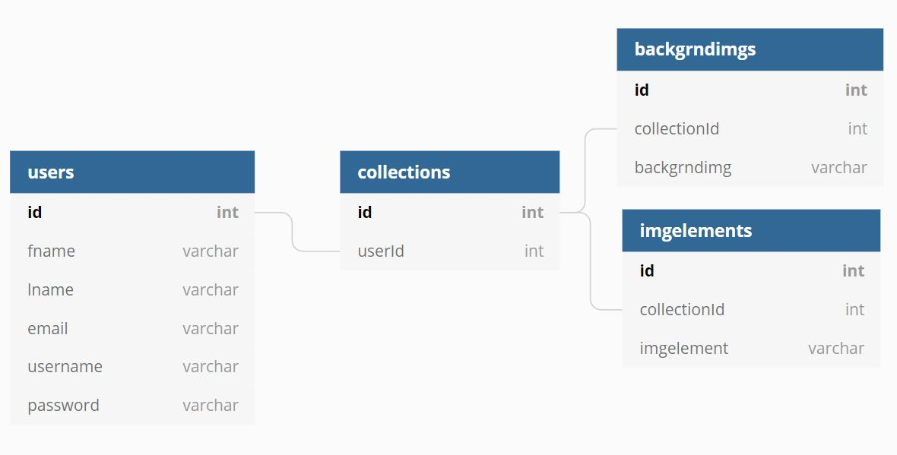
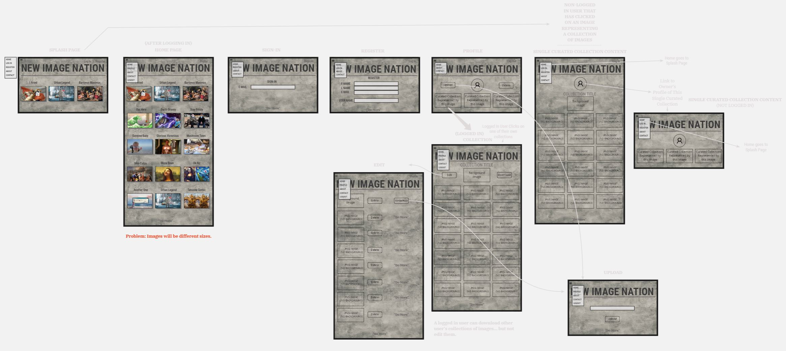

# Getting Started with Create React App

This project was bootstrapped with [Create React App](https://github.com/facebook/create-react-app).

## Available Scripts

In the project directory, you can run:

### `npm start`

Runs the app in the development mode.\
Open [http://localhost:3000](http://localhost:3000) to view it in the browser.

The page will reload if you make edits.\
You will also see any lint errors in the console.

### `npm test`

Launches the test runner in the interactive watch mode.\
See the section about [running tests](https://facebook.github.io/create-react-app/docs/running-tests) for more information.

### `npm run build`

Builds the app for production to the `build` folder.\
It correctly bundles React in production mode and optimizes the build for the best performance.

The build is minified and the filenames include the hashes.\
Your app is ready to be deployed!

See the section about [deployment](https://facebook.github.io/create-react-app/docs/deployment) for more information.

### `npm run eject`

**Note: this is a one-way operation. Once you `eject`, you can’t go back!**

If you aren’t satisfied with the build tool and configuration choices, you can `eject` at any time. This command will remove the single build dependency from your project.

Instead, it will copy all the configuration files and the transitive dependencies (webpack, Babel, ESLint, etc) right into your project so you have full control over them. All of the commands except `eject` will still work, but they will point to the copied scripts so you can tweak them. At this point you’re on your own.

You don’t have to ever use `eject`. The curated feature set is suitable for small and middle deployments, and you shouldn’t feel obligated to use this feature. However we understand that this tool wouldn’t be useful if you couldn’t customize it when you are ready for it.

## Learn More

You can learn more in the [Create React App documentation](https://facebook.github.io/create-react-app/docs/getting-started).

To learn React, check out the [React documentation](https://reactjs.org/).

### Code Splitting

This section has moved here: [https://facebook.github.io/create-react-app/docs/code-splitting](https://facebook.github.io/create-react-app/docs/code-splitting)

### Analyzing the Bundle Size

This section has moved here: [https://facebook.github.io/create-react-app/docs/analyzing-the-bundle-size](https://facebook.github.io/create-react-app/docs/analyzing-the-bundle-size)

### Making a Progressive Web App

This section has moved here: [https://facebook.github.io/create-react-app/docs/making-a-progressive-web-app](https://facebook.github.io/create-react-app/docs/making-a-progressive-web-app)

### Advanced Configuration

This section has moved here: [https://facebook.github.io/create-react-app/docs/advanced-configuration](https://facebook.github.io/create-react-app/docs/advanced-configuration)

### Deployment

This section has moved here: [https://facebook.github.io/create-react-app/docs/deployment](https://facebook.github.io/create-react-app/docs/deployment)

### `npm run build` fails to minify

This section has moved here: [https://facebook.github.io/create-react-app/docs/troubleshooting#npm-run-build-fails-to-minify](https://facebook.github.io/create-react-app/docs/troubleshooting#npm-run-build-fails-to-minify)

--------------------------------------------------------------------------------------------------------------------------------------

Front End Capstone Proposal

Name:  David Darden
Email Address: davidedarden83@gmail.com
Mentor’s Name: Red
Capstone Repo on Github: 
(Optional for Initial Proposal)
________________________________________
Project Overview
Name of Project: New Image Nation (Curated Collections of Visual Composition)
I plan to build an application to make creativity, image creation, and learning about visual composition more intuitive and more fun. The primary user of the application will be students, the secondary user will be design oriented individuals. When a user logs in to the app, they will be able to see various curated collections of images with creative titles. If they would like to take part in the community, they can register and login to upload and share their own curated collections of images.
The need for this app became clear when I was a middle school/ high school Art teacher. A requirement of the state’s standards was that the students use technology in part of their lessons. When I tried to teach the students how to create visual compositions on the computer, it seemed that they enjoyed the end results but there was a lot of frustration dealing with the process of finding the right images and learning new software. My application will, at the minimum, help to streamline this creative process.
Personally, I want to use this application to practice putting together all the pieces of the different projects we have done. I feel like I have been constantly wanting to go back and solidify what I have learned, and I feel that this project will help bring things together. This project will have a relatively large dataset of images that I will have curated and titled myself. I plan to make things as simple as possible for the user.
Features:
Users will only be able to interact with the community (upload, title, and share) when they are registered and logged in.
There will be a gallery of curated collections that a user will be able to scroll through.
Users that are not logged in will be able to browse collections, but not interact with the community.
Name of Project: New Image Nation (Curated Collections of Visual Composition)
Application Overview:
1.	What problem does your application solve? To combine images together on a computer, there are several methods and tools that people use. You have to spend hours learning photoshop (or some other program), download software, and wade through millions of images of various quality and size. The problem that my app solves is that it takes too much effort to create composite imagery with your computer.
2.	How will your application work? Features? Users will be able to browse other users curated collection of images. A logged in user (a member of the nation) will also be able to download other users’ collections and upload collection of their own.
3.	Why do you want to build this application? I want to work with images in a creative way.
4.	Who are the target users of this application? Students and individuals interested in visual design and creativity.
5.	Will you have multiple types of users? If so, what can each type of user do? There will only be one type of user. (Maybe two logged in user and not logged in user)

________________________________________

Application Planning 

Features included in MVP Definition: 
1.	User-specific data. (collections of curated images that belong to one user)
2.	Login
3.	Users will be able to upload and download images.

Features that are Stretch Goals:
1.	Users will be able to compose an image on the website itself.
2.	A ranking system of users.
3.	A “like” functionality.
4.	Ordering collections by most to least liked.
5.	Logged in users will be able to edit and delete their images.
6.	Logged-In Users will have user icons or user images.
7.	Use Cloudinary

Things you want your mentor to check in on:
1.	Progress towards MVP is on track.

________________________________________

Technology Stack: 
HTML/CSS/JAVASCRIPT/REACT

ERD: 
 

User Stories on Github: 
(Must be written using GIVEN, WHEN, and THEN (AND, BUT))
Given that I am a logged in user, when I upload an image, it should be stored in/assigned to, one of my collections and then it should populate/ be shared on the splash and home pages. 

Mockup/Wireframes: 
 
________________________________________

Other Research

Research for any external libraries/tools/technology your application will be using: (External API’S, packages, etc.)
1.	Cloudinary
